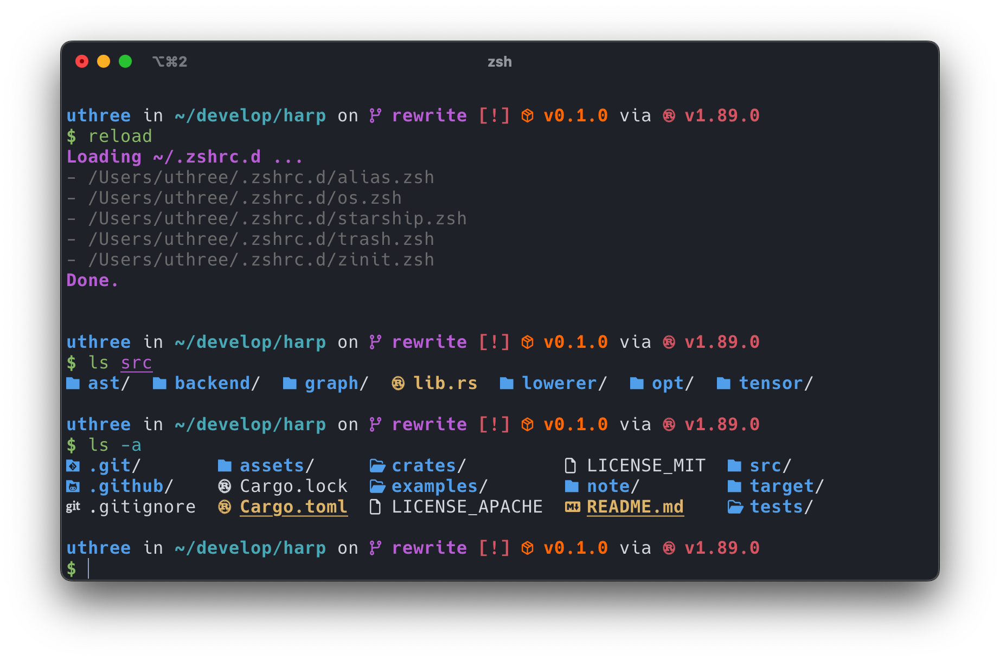

# dotfiles
configuration files and install script  

### screenshot (iTerm2)

## Features
- [zsh](https://ja.wikipedia.org/wiki/Z_Shell): shell
- [helix](https://github.com/helix-editor/helix): text editor
- [eza](https://github.com/eza-community/eza): ls alternative
- [zellij](https://github.com/zellij-org/zellij): tmux alternative
- [alacritty](https://github.com/alacritty/alacritty): terminal
- [starship](https://starship.rs/ja-jp/): improve prompt
- [vim](https://github.com/vim/vim): text editor
- [zoxide](https://github.com/ajeetdsouza/zoxide): cd alternative
- [fzf](https://github.com/junegunn/fzf): fuzzy finder
- Trash
    - replace `rm` command to moving `~/.Trash/` directory.
    - run `clear-trash` to delete old trash files.
    - run `clear-trash-all` to delete all trash files.
- command aliases

## Requirements
- zsh

## Installation
- run `auto_install.sh`