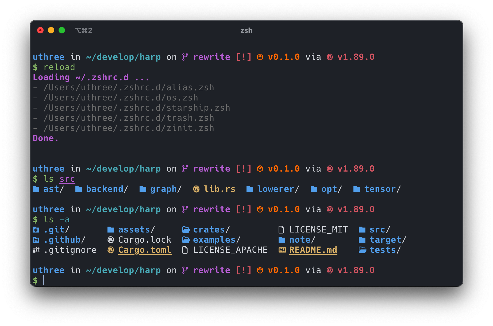

# dotfiles
configuration files and install script  

### screenshot (iTerm2)


## Features
- [zsh](https://ja.wikipedia.org/wiki/Z_Shell): shell (Linux / macOS)
- [PowerShell](https://learn.microsoft.com/powershell/): shell (Windows)
- [zed](https://zed.dev/): text editor
- [helix](https://github.com/helix-editor/helix): text editor
- [eza](https://github.com/eza-community/eza): ls alternative
- [zellij](https://github.com/zellij-org/zellij): tmux alternative (Linux / macOS only)
- [alacritty](https://github.com/alacritty/alacritty): terminal
- [starship](https://starship.rs/ja-jp/): improve prompt
- [vim](https://github.com/vim/vim): text editor
- [zoxide](https://github.com/ajeetdsouza/zoxide): cd alternative
- [fzf](https://github.com/junegunn/fzf): fuzzy finder
- [fcp](https://github.com/Svetlitski/fcp): cp alternative

- Trash: `rm` moves to `~/.Trash/` instead of deleting
- command aliases
- global instructions for [Claude Code](https://claude.com/claude-code) (`~/.claude/CLAUDE.md`)

## Requirements
- zsh (Linux / macOS)
- Windows PowerShell 5.1 or PowerShell 7 (Windows)

## Installation

### Linux / macOS
- run `auto_install.sh`

### Windows
```powershell
powershell -ExecutionPolicy Bypass -File .\auto_install.ps1
```

See [doc/windows.md](doc/windows.md) for the other entry points and for what
gets linked where.

## Documentation
- [doc/windows.md](doc/windows.md): installing and linking on Windows
- [doc/shell.md](doc/shell.md): what the shell configuration provides
- [doc/coding-agents.md](doc/coding-agents.md): why the aliases are interactive only
